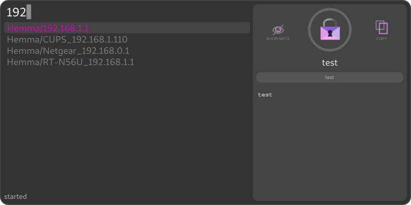
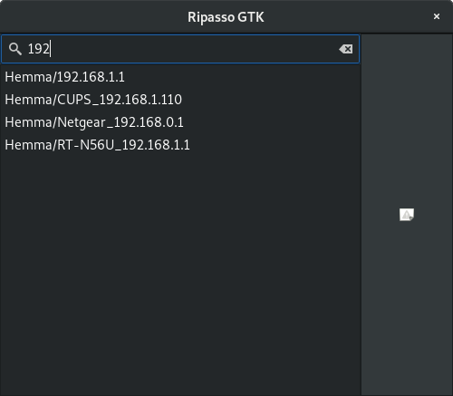

# ripasso
[](https://travis-ci.org/cortex/ripasso)

A simple password manager written in Rust

The root crate `ripasso` is as a library for accessing and decrypting passwords
stored in pass format (GPG-encrypted files), with a file-watcher event emitter.

Multiple UI:s in different stages of develapment are available in subcrates.

To build all UI:s
```
cargo build --all
```

PRs are very welcome!

## History
This is a reimplementation of https://github.com/cortex/gopass in Rust. I started it mainly because since https://github.com/go-qml/qml
is unmaintaned. Also, using a safe language for you passwords seems like a good idea.

It has not yet reached feature-parity, but the basic functionality works. If this plays out well, it will replace gopass.

## UI:s

### Cursive - Terminal interface


TUI interface based on [cursive](https://github.com/gyscos/Cursive)
Supports password age display and password editing.
I use this as my daily password-manager.

#### Build
```
cargo build -p ripasso-cursive
```


### QT GUI - (unstable)

This is mostly working, but needs updates.

#### Build

```
cargo build -p ripasso-qt
```
For it to run, you need to be in the qml directory.

```
cd qml
cargo run
```

### GTK GUI - (WIP)

Build

```
cargo build -p ripasso-gtk
```


## Build dependencies

### Mac OS X

```
$ brew update
$ brew install automake cmake gettext qt5 gtk+3
$ export PATH="/usr/local/opt/qt/bin:$PATH"
$ git clone https://github.com/cortex/ripasso.git
$ cd ripasso
$ cargo run
```

### Ubuntu
```
$ apt install cargo libgtk-3-dev qtdeclarative5-dev libqt5svg5-dev cmake libncurses-dev libssl-dev
$ cargo build
```

### Arch
```
$ pacman -S qt5-base qt5-svg qt5-declarative
```
