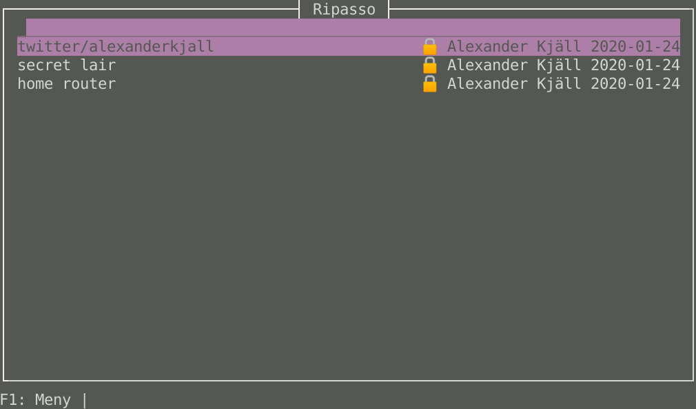

# ripasso
[](https://github.com/cortex/ripasso/actions/workflows/rust.yml)
[](https://crates.io/crates/ripasso)
[](https://docs.rs/ripasso/)
[](https://repology.org/project/ripasso-cursive/versions)

A simple password manager written in Rust.

The root crate `ripasso` is a library for accessing and decrypting passwords
stored in [pass](https://www.passwordstore.org/) format, that means
PGP-encrypted files optionally stored in a git repository.

Multiple UI's in different stages of development are available in subcrates.

To build all UI's:
```
cargo build --all
```

PR's are very welcome!

## History
This is a reimplementation of https://github.com/cortex/gopass in Rust. I started it mainly because https://github.com/go-qml/qml
is unmaintained. Also, using a safe language for your passwords seems like a good idea.

## UI's

### Cursive - Terminal interface


TUI interface based on [cursive](https://github.com/gyscos/Cursive)
Supports password age display and password editing.
I use this as my daily password-manager.

#### Build
```
cargo build -p ripasso-cursive
```

### GTK GUI - (WIP)


Not at feature-parity with the cursive code base yet, but basic operations work.

#### Build

```
cargo build -p ripasso-gtk
```

## Install instructions

### Arch

TUI version
```
paru install ripasso-cursive
```

### Fedora

Available in [Copr](https://copr.fedorainfracloud.org/coprs/atim/ripasso/)
```
sudo dnf copr enable atim/ripasso -y
```

TUI version
```
sudo dnf install ripasso
```

GTK version (unstable)
```
sudo dnf install ripasso-gtk
```

### Nix

TUI version
```
nix-env -iA nixpkgs.ripasso-cursive
```

### Mac OS X

The best way to install ripasso on mac right now is the nix package system, first [install that](https://nixos.org/nix/download.html) and then

```
nix-env -iA nixpkgs.ripasso-cursive
```

### Alpine

Ripasso-cursive is currently in the testing repository for apk, so the testing repository needs to be added to the apk repositories file.

TUI version
```
apk add ripasso-cursive
```

## Build instructions

[See here](https://github.com/cortex/ripasso/blob/master/BUILD_INSTRUCTIONS.md)

## Translations

Do you want to have ripasso in your native language? Help out with a translation:

[See here](https://github.com/cortex/ripasso/blob/master/TRANSLATIONS.md)
